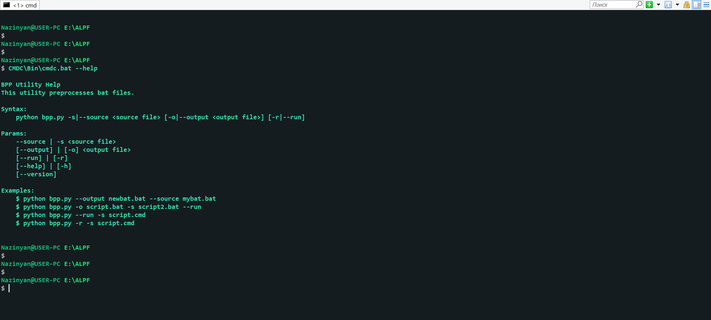
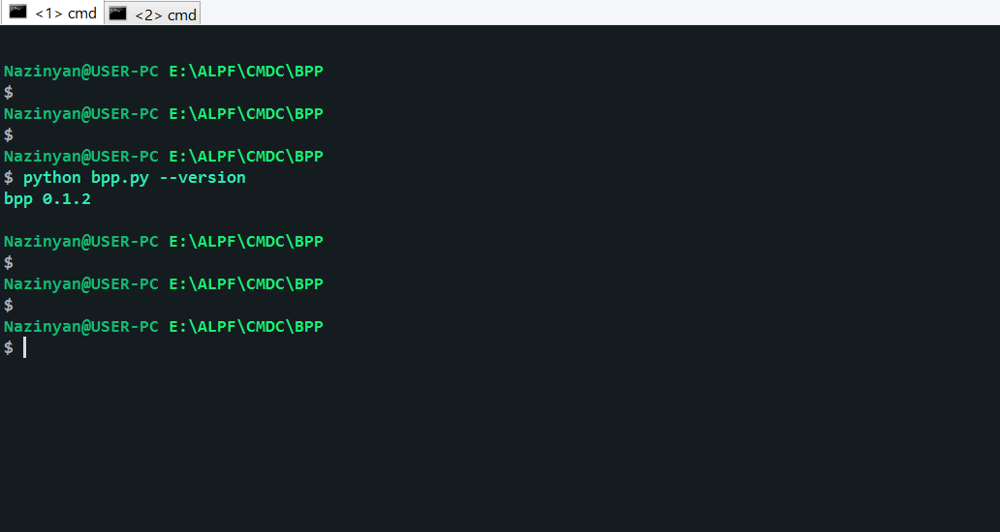

# CMDC is a platform for working with cmd.exe (Batch)

---

​

CMDC is, in fact, a set of tools,
it currently contains only BPP (Batch Preprocessor)
BPP is a batch preprocessor that only processes
[":#include"](https://en.wikipedia.org/wiki/Include_directive#C/C++ "Wikipedia: Include directive in C/C++")

CMDC was designed to breathe new life into cmd.exe (Batch) -
so that people can write libraries for it.

At the beginning of the creation of the CMDC,
it should have had more functionality, but the most basic was added.
CMDC can be extended with your own tools, etc.

In the future, the set of tools may be increased.

---

## The CMDC originally included

* BPP
* Linker
* BLIB

BPP remained, but Linker and BLIB were not implemented.
"BLIB" folder which is at the root of the project, it will be implemented in the future.
"Linker" was simply not implemented because there is no need for it.
But still the CMDC does its job,
and therefore it can be used to facilitate code reuse.
You can write your own libraries and then connect them to another file via ":#include".
In general, this is its main functionality at the moment.
This tool will not work on an operating system other than Windows.
BPP is cross-platform. but even it will work more correctly on Windows.

BPP can be used separately from CMDC if desired.
BPP is simply part of the CMDC.
For this there is a separate repository where only BPP.

CMDC also had to have a compiler, it had to add new syntax to Batch.
But it was decided to refuse this.
But if you want to implement something like that, then this is welcome.

## About BPP utility

BPP is the main tool of CMDC.
It is a console utility, and when you run the cmdc.bat utility,
it eventually starts the BPP utility
([bpp.bat](./Bin/bpp.bat "file: bpp.bat") and [bpp.py](./BPP/bpp.py "file: bpp.py") through it).
BPP is a multi-module utility,
which is written entirely in Python.
For BPP to work, you need a Python interpreter, oddly enough.
A Python interpreter is shipped with the CMDC.

## BPP added the command

"#include", but in the future, the list of different innovations will expand
in fact, you can now create your own libraries for Bat files.

It just parses the original file and finds those "#include",
and replaces the expressions. etc.

## BLIB (Batch Library) - what can tell about it?

It should have had different BPP header files.
For example, "exceptions.hbat", etc.
Extension ".hbat" - (Header Batch)
But it was also decided to abandon this idea.
In general, no one bothers users to write libraries and add them to the BLIB folder.
More details in [blib.md](./Doc/blib.md "Doc for BLIB")

At the moment, CMDC has basic capabilities and will be expanded in the future.

---

## Most of the CMDC tools are written in Python

BPP is written entirely in Python.
Some scripts are written in Batch (cmd.exe).
There is a Python interpreter in the CMDC space.
It is located in the Python folder, which is at the root of the CMDC.
BPP scripts are run through it.
The interpreter Python Embed version 3.8.5 is used.

---

## Feel free to improve the CMDC

If you have any ideas or code regarding innovations in this project,
then do not hesitate to send the repository author: [fex1](https://github.com/fex7 "Author CMDC")

This will allow for the development of CMDC.

---

## Example command from BPP

---

## The syntax for the cmdc.bat utility

> cmdc.bat \[-s | --source \<source file\>\] \[-o | --output \<output file\>\] \[-r | --run\]

For more details on these parameters read **["bpp.md"](./../BPP/Doc/bpp.md)**

This utility eventually runs **["bpp.py"](./../BPP/bpp.py)**, passes all -
the command line arguments and therefore supports all -
parameters that **`bpp.py`** supports.

**`cmdc.bat`** first runs bpp.bat and passes command line arguments.
Then bpp.bat runs **`bpp.py`** and passes the arguments,
it does this through the python interpreter supplied with the CMDC.
And **`bpp.py`** just does whatever it needs with these arguments.

---

Read [blib.md](./Doc/blib.md "Doc for BLIB") and
[bpp.md](./BPP/Doc/bpp.md "Doc for BPP") for more information.
